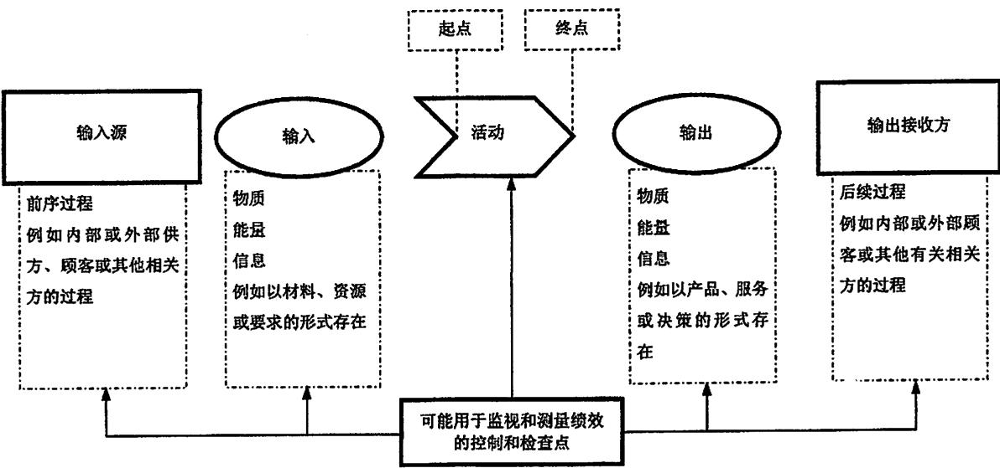
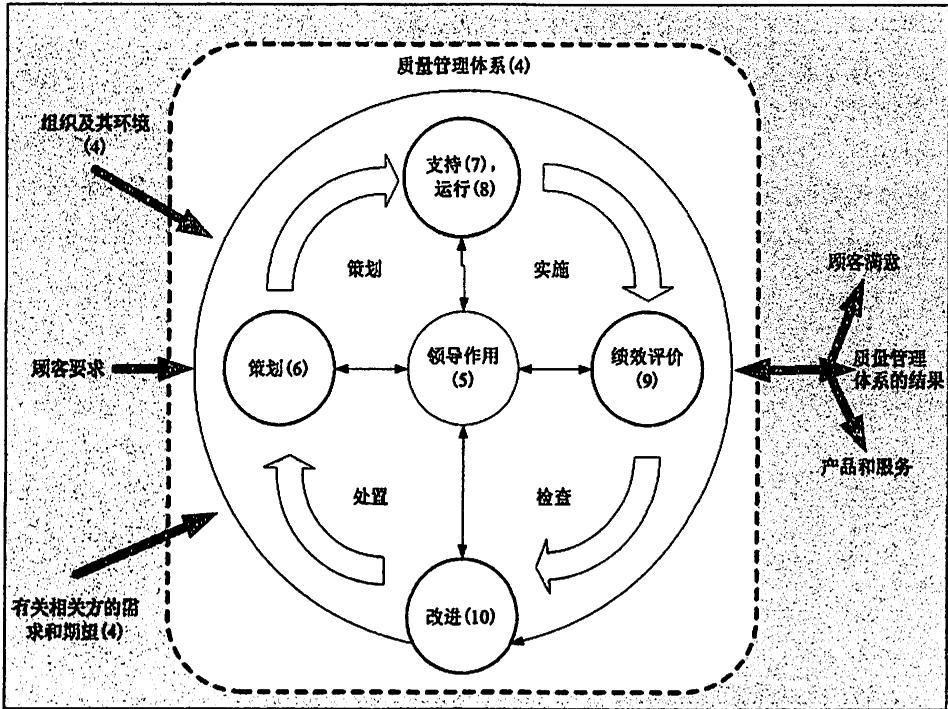

## 引 言

## 0.1 总则

采用质量管理体系是组织的一项战略决策，能够帮助其提高整体绩效，为推动可持续发展奠定良好基础。

组织根据本标准实施质量管理体系的潜在益处是：

a)稳定提供满足顾客要求以及适用的法律法规要求的产品和服务的能力；

b) 促成增强顾客满意的机会：

c) 应对与组织环境和目标相关的风险和机遇；

d) 证实符合规定的质量管理体系要求的能力：

e) 证实具备承担装备建设相关任务的能力。

本标准可用于内部和外部各方。

实施本标准并非需要：

——统一不同质量管理体系的架构；

——形成与本标准条款结构相一致的文件：

——在组织内使用本标准的特定术语。

本标准规定的质量管理体系要求是对产品和服务要求的补充。

本标准采用过程方法，该方法结合了“策划一实施一检查一处置”(PDCA)循环和基于风险的思维。

过程方法使组织能够策划过程及其相互作用。

PDCA循环使组织能够确保其过程得到充分的资源和管理，确定改进机会并采取行动。

基于风险的思维使组织能够确定可能导致其过程和质量管理体系偏离策划结果的各种因素，采取预防控制，最大限度地降低不利影响，并最大限度地利用出现的机遇(见A.4)。

在日益复杂的动态环境中持续满足要求，并针对未来需求和期望采取适当行动，这无疑是组织面临的一项挑战。为了实现这一目标，组织可能会发现，除了纠正和持续改进，还有必要采取各种形式的改进，如突破性变革、创新和重组。

在本标准中使用如下助动词：

—“应”表示要求；

—“宜”表示建议；

—“可”表示允许；

—“能”表示可能或能够。

“注”的内容是理解和说明有关要求的指南。

## 0.2 质量管理原则

本标准是在GB/T19000所阐述的质量管理原则基础上制定的。每项原则的介绍均包含概述、该原则对组织的重要性的依据，应用该原则的主要益处示例以及应用该原则提高组织绩效的典型措施示例。

质量管理原则是：

——以顾客为关注焦点：

——领导作用；

——全员积极参与；

——过程方法；

——改进：

——循证决策；

—关系管理。

## 0.3 过程方法

## 0.3.1 总则

本标准倡导在建立、实施质量管理体系以及提高其有效性时采用过程方法，通过满足顾客要求增强顾客满意。采用过程方法所需考虑的具体要求见4.4。

将相互关联的过程作为一个体系加以理解和管理，有助于组织有效和高效地实现其预期结果。这种方法使组织能够对体系的过程之间相互关联和相互依赖的关系进行有效控制，以提高组织整体绩效。

过程方法包括按照组织的质量方针和战略方向，对各过程及其相互作用进行系统的规定和管理，从而实现预期结果。可通过采用PDCA循环(见0.3.2)以及始终基于风险的思维(见0.3.3)对过程和整个体系进行管理，旨在有效利用机遇并防止发生不良结果。

在质量管理体系中应用过程方法能够：

a) 理解并持续满足要求；

b) 从增值的角度考虑过程；

c) 获得有效的过程绩效；

d) 在评价数据和信息的基础上改进过程。

单一过程的各要素及其相互作用如图1所示。每一过程均有特定的监视和测量检查点以用于控制，这些检查点根据相关的风险有所不同。

  
图 1 单一过程要素示意图

## 0.3.2 PDCA 循环

PDCA循环能够应用于所有过程以及整个质量管理体系。图2表明了本标准第4章至第10章是如何构成 PDCA 循环的。

PDCA循环可以简要描述如下：

—策划(Plan)：根据顾客的要求和组织的方针，建立体系的目标及其过程，确定实现结果所需的资源，并识别和应对风险和机遇；

——实施(Do)：执行所做的策划;

——检查(Check)：根据方针、目标、要求和所策划的活动，对过程以及形成的产品和服务进行监视和测量(适用时)，并报告结果；

—处置(Act)：必要时，采取措施提高绩效。

## 0.3.3 基于风险的思维

基于风险的思维(见A.4)是实现质量管理体系有效性的基础。本标准以前的版本已经隐含基于风险思维的概念，例如：采取预防措施消除潜在的不合格，对发生的不合格进行分析，并采取与不合格的影响相适应的措施，防止其再发生。

为满足本标准的要求，组织需策划和实施应对风险和机遇的措施。应对风险和机遇，为提高质量管理体系有效性、获得改进结果以及防止不利影响奠定基础。

某些有利于实现预期结果的情况可能导致机遇的出现，例如：有利于组织吸引顾客、开发新产品和服务、减少浪费或提高生产率的一系列情形。利用机遇所采取的措施也可能包括考虑相关风险。风险是不确定性的影响，不确定性可能有正面的影响，也可能有负面的影响。风险的正面影响可能提供机遇但并非所有的正面影响均可提供机遇。

  
注：括号中的数字表示本标准的相应章节。

图 2 本标准的结构在 PDCA 循环中的展示

## 0.4 与其他管理体系标准的关系

本标准采用ISO制定的管理体系标准框架，以提高与其他管理体系标准的协调一致性(见A.1)。

本标准使组织能够使用过程方法，并结合PDCA循环和基于风险的思维，将其质量管理体系与其他管理体系标准要求进行协调或一体化。

本标准(A 部分)与 GB/T 19000 和 GB/T 19004 存在如下关系：

—GB/T19000《质量管理体系基础和术语》为正确理解和实施本标准提供必要基础：

——GB/T19004《追求组织的持续成功质量管理方法》为选择超出本标准要求的组织提供指南。

本标准(A部分)不包括针对环境管理、职业健康和安全管理或财务管理等其他管理体系的特定要

求。

在本标准(A部分)的基础上，已经制定了若干行业特定要求的质量管理体系标准。其中的某些标准规定了质量管理体系的附加要求，而另一些标准则仅限于提供在特定行业应用本标准的指南。

本标准(A部分)的章条内容与之前版本(GB/T19001-2008/ISO9001：2008)章条内容之间的对应关系见ISO/TC176/SC2(国际标准化组织/质量管理和质量保证技术委员会/质量体系分委员会)的公开网站：www.iso.org/tc176/sc02/public。

## 0.5 本标准装备特殊要求的考虑

本标准在等同采用国家标准GB/T 19001-2016的基础上增加装备质量管理体系的特殊要求(B部分)，这样做的重要意义在于：

a) 坚持质量至上，突出满足作战使用需求和实战化运用要求。装备使用基于严酷的作战环境，其质量关乎战争胜负、关乎官兵生命，质量管理体系特殊要求突出装备的可靠性、维修性、保障性、测试性、安全性和环境适应性等通用质量特性要求；突出标准化、软件工程化、技术状态管理等控制要求；突出新产品试制、试验和关键过程控制的要求；突出装备交付后的维修、保障和质量事故处理要求。

b) 贯彻军民融合国家战略，突出军品必为精品的要求。引导组织在构建质量管理体系时，首先应满足国家标准要求，在此基础上，满足装备的特殊要求，促进其产品和服务的质量管理体系过程军民通用，提升质量管理体系能力和水平，降低组织的管理成本。

c) 保持科学性、针对性和前瞻性，提高可操作性。本标准试图将国家标准中较为通用的要求具体化，较为宽泛的选择更具针对性，引导组织建立装备质量管理体系并更具适用性；基于风险管理先进理念，合理提出质量管理体系特殊要求，满足当前和未来信息化体系建设要求。

# 质量管理体系要求

## 1 范围

本标准为下列组织规定了质量管理体系要求：

a)需要证实其具有稳定提供满足顾客要求及适用法律法规要求的产品和服务的能力；

b) 通过体系的有效应用，包括体系改进的过程，以及保证符合顾客要求和适用的法律法规要求，旨在增强顾客满意。

本标准规定的所有要求是通用的，旨在适用于各种类型、不同规模和提供不同产品和服务的组织。

本标准适用于承担军队装备及配套产品论证、研制、生产、试验、维修和服务任务的组织，提供其他军用产品和服务的组织可参照使用。

注1：在本标准中的术语“产品”或“服务”仅适用于预期提供给顾客或顾客所要求的产品和服务。

注2：法律法规要求可称作为法定要求。

注3：本标准中的组织是指各类军队装备的承制单位。

注4：本标准中的顾客是指产品和服务的接受者，包括军队装备机关、军事代表机构、项目管理机构、装备使用部队，以及供应链中的订购方。

## 2 规范性引用文件

下列文件对于本文件的应用是必不可少的。凡是注日期的引用文件，仅注日期的版本适用于本文件。凡是不注日期的引用文件，其最新版本(包括所有的修改单)适用于本文件。

GB/T19000-2016 质量管理体系基础和术语

GJB 190 特性分类

GJB 368 装备维修性工作通用要求

GJB 450 装备可靠性工作通用要求

GJB 451 可靠性维修性保障性术语

GJB 571 不合格品管理

GJB 841 故障报告、分析和纠正措施系统

GJB 900 装备安全性工作通用要求

GJB 907 产品质量评审

GJB 908 首件鉴定

GJB 909 关键件和重要件的质量控制

GJB 1269 工艺评审

GJB 1362 军工产品定型程序和要求

GJB 1405 装备质量管理术语

GJB 1710 试制和生产准备状态检查

GJB 1909 装备可靠性维修性保障性要求论证

GJB 2547 装备测试性工作通用要求

GJB 2786 军用软件开发通用要求

GJB 3206 技术状态管理

GJB 3872 装备综合保障通用要求

GJB 4239 装备环境土程通用要求